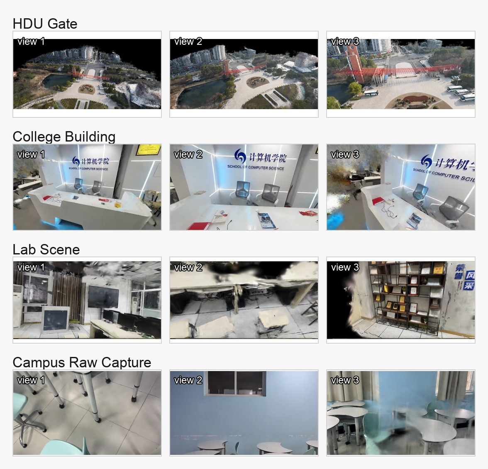
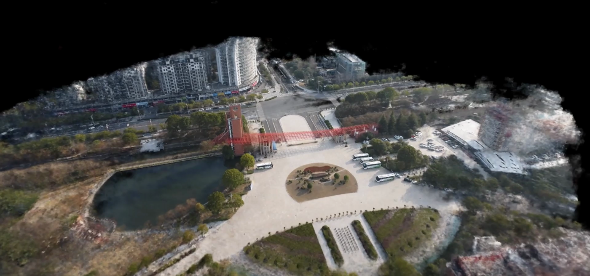
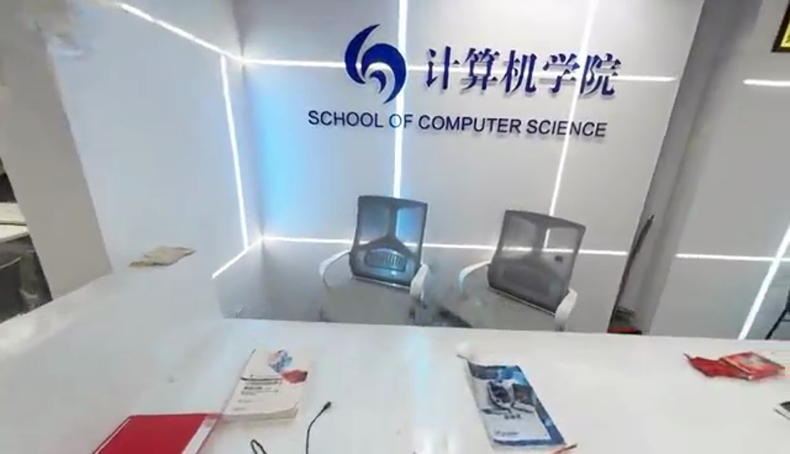
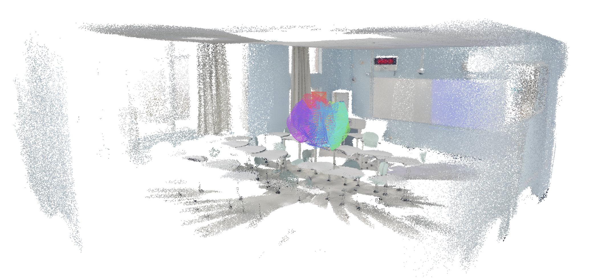
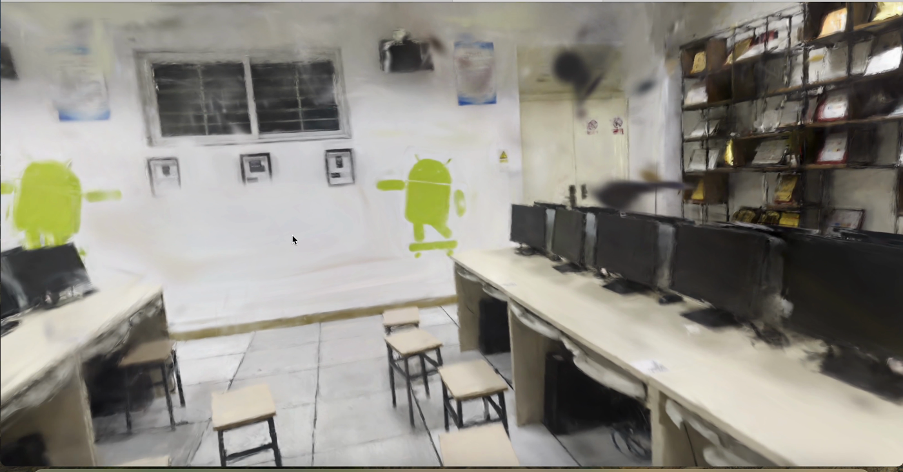
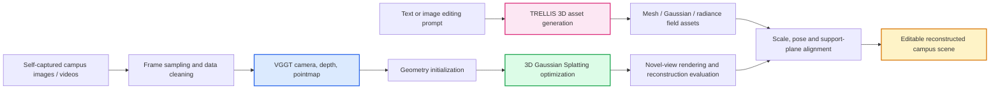

<div align="center">

# DeepLearning Final: Campus 3D Reconstruction and Editing

**VGGT geometry initialization · 3D Gaussian Splatting reconstruction · TRELLIS generative 3D editing**

[](#)
[](#)
[](latex报告模板/main.pdf)
[](latex报告模板/main.tex)

</div>

---

## Project Snapshot

本仓库是深度学习课程期末报告项目，主题为**三维重建与三维编辑**。项目围绕校园真实场景采集数据，尝试构建一条从多视角图像到可编辑三维场景的实验链路：先利用 **VGGT** 估计相机、深度与点云几何，再结合 **3D Gaussian Splatting** 获得高质量可渲染场景，最后讨论使用 **TRELLIS** 等三维生成技术进行局部资产生成与场景编辑。

当前仓库已经包含完整 LaTeX 报告、编译后的 PDF、重建结果图片、方法 pipeline 图和课程报告相关素材。

<div align="center">
  <a href="latex报告模板/main.pdf"><b>Open Final Report PDF</b></a>
  ·
  <a href="latex报告模板/main.tex"><b>LaTeX Source</b></a>
  ·
  <a href="latex报告模板/sections/06-experiments.tex"><b>Experiments Section</b></a>
</div>

## Visual Results

<div align="center">
  
  <br>
  <sub>Self-captured campus scenes rendered from multiple views.</sub>
</div>

<br>

<table>
  <tr>
    <td width="50%"></td>
    <td width="50%"></td>
  </tr>
  <tr>
    <td align="center"><b>Campus Gate</b></td>
    <td align="center"><b>College Building</b></td>
  </tr>
  <tr>
    <td width="50%"></td>
    <td width="50%"></td>
  </tr>
  <tr>
    <td align="center"><b>Classroom</b></td>
    <td align="center"><b>Laboratory</b></td>
  </tr>
</table>

## Reconstruction Videos

GitHub README does not reliably render embedded MP4 players, so the page uses animated GIF previews. Click any preview to open the full MP4.

<table>
  <tr>
    <td width="50%">
      <a href="assets/videos/hdu-gate-reconstruction.mp4">
        
      </a>
    </td>
    <td width="50%">
      <a href="assets/videos/college-reconstruction.mp4">
        
      </a>
    </td>
  </tr>
  <tr>
    <td align="center"><b>Campus Gate Fly-through</b></td>
    <td align="center"><b>College Gaussian Scene</b></td>
  </tr>
  <tr>
    <td width="50%">
      <a href="assets/videos/indoor-raw-reconstruction.mp4">
        
      </a>
    </td>
    <td width="50%">
      <a href="assets/videos/lab-reconstruction.mp4">
        
      </a>
    </td>
  </tr>
  <tr>
    <td align="center"><b>Indoor Reconstruction Sequence</b></td>
    <td align="center"><b>Laboratory Reconstruction</b></td>
  </tr>
</table>

## Method Pipeline



## What Is Inside

| Path | Content |
| --- | --- |
| [`latex报告模板/main.pdf`](latex报告模板/main.pdf) | 编译后的最终课程报告 PDF |
| [`latex报告模板/main.tex`](latex报告模板/main.tex) | LaTeX 主文件 |
| [`latex报告模板/sections`](latex报告模板/sections) | 报告各章节源码 |
| [`latex报告模板/figures`](latex报告模板/figures) | pipeline 图、校园重建图、编辑示意图 |
| [`assets/videos`](assets/videos) | README 动图可点击打开的轻量 MP4 视频 |
| [`assets/previews`](assets/previews) | GitHub README 直接展示的 GIF 动图预览 |
| [`素材`](素材) | 项目素材、参考文档与采集数据 |

## Report Highlights

- **VGGT 几何基础**：整理了从图像输入到相机位姿、深度图、pointmap 和 confidence 的统一几何预测流程。
- **3DGS 场景重建**：围绕校园校门、学院、教室、实验室等真实场景展示重建结果，并给出 PSNR / SSIM / LPIPS 风格的重建指标表。
- **TRELLIS 三维生成**：复现独立的图像/文本条件三维资产生成流程，讨论 mesh、Gaussian 和 radiance field 产物边界。
- **三维编辑设计**：给出从生成资产到重建场景的尺度对齐、支撑面约束、局部融合和重渲染评价方案。
- **课程报告完整性**：包含摘要、相关工作、理论基础、方法设计、实现细节、实验结果和未来工作。

## Build The Report

进入 LaTeX 模板目录后编译：

```bash
cd latex报告模板
tectonic -X compile main.tex
```

编译完成后 PDF 位于：

```text
latex报告模板/main.pdf
```

## Reconstruction Evaluation

报告中采用三维重建论文常用的定量指标组织实验结果：

| Metric | Better | Meaning |
| --- | --- | --- |
| PSNR | Higher | held-out 视角渲染图与真实图像的像素一致性 |
| SSIM | Higher | 结构、纹理和边缘相似性 |
| LPIPS | Lower | 感知层面的视觉差异 |

这些指标与多视角可视化结果结合，用于分析校园场景中建筑轮廓、弱纹理墙面、反光区域、黑色显示器边缘和快速运动片段对重建质量的影响。

## Repository Notes

本仓库聚焦课程报告交付。视频和较大的中间文件不作为核心提交内容；报告中使用的关键图片、LaTeX 源码和最终 PDF 已保留在仓库中，便于直接查看和复现编译。

---

<div align="center">

**From campus photos to editable 3D scenes.**

</div>
